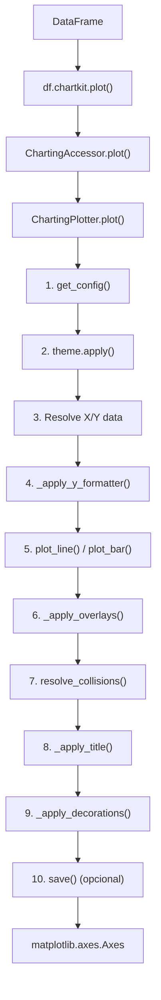

# Architecture

Documentacao da arquitetura interna para contribuidores.

## Estrutura de Modulos

```
src/chartkit/
├── __init__.py           # Entry point, exports publicos
├── accessor.py           # Pandas DataFrame accessor (.chartkit)
├── engine.py             # ChartingPlotter - orquestrador principal
├── settings/             # Sistema de configuracao TOML
│   ├── __init__.py       # Exports: configure, get_config, ChartingConfig
│   ├── schema.py         # Dataclasses tipadas para configuracao
│   ├── defaults.py       # Valores default neutros
│   ├── loader.py         # ConfigLoader e funcoes publicas
│   ├── toml.py           # Utilitarios de parsing TOML e deep merge
│   ├── converters.py     # Conversao dataclass <-> dict
│   ├── discovery.py      # Descoberta de project root e arquivos de config
│   ├── paths.py          # PathResolver - resolucao unificada de paths
│   └── ast_discovery.py  # Auto-discovery de paths via AST parsing
├── styling/
│   ├── __init__.py       # Facade
│   ├── theme.py          # ChartingTheme (usa settings)
│   ├── formatters.py     # Formatadores de eixo Y (usa settings)
│   └── fonts.py          # Carregamento de fontes (usa settings)
├── charts/               # Tipos de graficos (anteriormente plots/)
│   ├── __init__.py       # Facade: plot_line, plot_bar
│   ├── line.py           # Grafico de linhas
│   └── bar.py            # Grafico de barras
├── overlays/             # Elementos visuais secundarios
│   ├── __init__.py       # Facade
│   ├── moving_average.py # Media movel
│   ├── reference_lines.py # ATH, ATL, hlines
│   ├── bands.py          # Bandas sombreadas
│   └── markers.py        # Highlight de pontos/barras (movido de components/)
├── decorations/          # Decoracoes visuais
│   ├── __init__.py       # Facade: add_footer
│   └── footer.py         # Rodape (usa settings.branding)
├── transforms/           # Transformacoes temporais (anteriormente transforms.py)
│   ├── __init__.py       # Facade: yoy, mom, accum_12m, etc.
│   └── temporal.py       # Implementacoes das transformacoes
└── _internal/            # Utilitarios privados (nao expor)
    ├── __init__.py       # Facade: resolve_collisions
    └── collision.py      # Resolucao de colisoes de labels
```

---

## Sistema de Configuracao

### Visao Geral

O sistema de configuracao usa TOML e dataclasses tipadas para permitir
personalizacao completa da biblioteca. Todos os valores hardcoded foram
movidos para configuracoes.

### Modulos

#### settings/schema.py

Define dataclasses tipadas para cada secao de configuracao:

```python
@dataclass
class BrandingConfig:
    company_name: str
    footer_format: str
    footer_format_no_source: str

@dataclass
class ColorsConfig:
    primary: str
    secondary: str
    # ...
    def cycle(self) -> list[str]: ...

@dataclass
class ChartingConfig:
    branding: BrandingConfig
    colors: ColorsConfig
    fonts: FontsConfig
    layout: LayoutConfig
    # ... todas as subsecoes
```

#### settings/defaults.py

Instancia `DEFAULT_CONFIG` com valores neutros:

```python
DEFAULT_CONFIG = ChartingConfig(
    branding=BrandingConfig(
        company_name="",
        # ...
    ),
    colors=ColorsConfig(
        primary="#00464D",
        # ...
    ),
    # ...
)
```

#### settings/loader.py

Carrega e faz merge de configuracoes de multiplas fontes:

```python
class ConfigLoader:
    def configure(self, config_path=None, outputs_path=None, assets_path=None, **overrides): ...
    def get_config(self) -> ChartingConfig: ...
    def reset(self): ...

    # Properties com cache interno
    @property
    def project_root(self) -> Optional[Path]: ...  # Lazy init, resolve uma vez por sessao
    @property
    def outputs_path(self) -> Path: ...
    @property
    def assets_path(self) -> Path: ...
    @property
    def charts_path(self) -> Path: ...

# Funcoes publicas
def configure(**kwargs) -> ConfigLoader: ...
def get_config() -> ChartingConfig: ...
def reset_config() -> ConfigLoader: ...
def get_outputs_path() -> Path: ...
def get_assets_path() -> Path: ...
def get_charts_path() -> Path: ...
```

#### settings/discovery.py

Descoberta de project root e arquivos de configuracao:

```python
# Cache module-level para evitar I/O redundante
_project_root_cache: dict[Path, Optional[Path]] = {}

def find_project_root(start_path: Optional[Path] = None) -> Optional[Path]:
    """Busca recursiva pelo project root usando markers (com cache)."""
    ...

def reset_project_root_cache() -> None:
    """Limpa o cache de project root. Util para testes."""
    ...

def find_config_files(project_root: Optional[Path] = None) -> list[Path]:
    """Encontra arquivos de configuracao em ordem de precedencia."""
    ...
```

#### settings/paths.py

Resolucao unificada de paths com cadeia de precedencia:

```python
class PathResolver:
    """
    Resolve paths usando cadeia de precedencia:
        1. Configuracao explicita via API (configure)
        2. Configuracao no TOML
        3. Auto-discovery via AST
        4. Fallback (project_root/subdir)
    """

    def __init__(
        self,
        name: str,
        explicit_path: Optional[Path],
        toml_getters: list[Callable[[], Optional[str]]],
        discovery_getter: Callable[[], Optional[Path]],
        fallback_subdir: str,
        project_root: Optional[Path] = None,  # DI para evitar chamadas repetidas
    ): ...

    def resolve(self) -> Path: ...
```

#### settings/ast_discovery.py

Auto-discovery de paths via AST parsing (sem importar modulos):

```python
class ASTPathDiscovery:
    """Descobre OUTPUTS_PATH e ASSETS_PATH de projetos host via AST."""

    def __init__(self, project_root: Path): ...
    def discover(self) -> DiscoveredPaths: ...
```

### Ordem de Precedencia

1. `configure()` - Overrides programaticos
2. `configure(config_path=...)` - Arquivo explicito
3. `.charting.toml` / `charting.toml` - Projeto local
4. `pyproject.toml [tool.charting]` - Secao no pyproject
5. `~/.config/charting/config.toml` - Usuario global
6. Defaults built-in

### Merge de Configuracoes

O loader faz deep merge de dicionarios:

```python
base = {'colors': {'primary': '#000'}, 'layout': {'dpi': 100}}
override = {'colors': {'primary': '#FFF'}}
# Resultado: {'colors': {'primary': '#FFF'}, 'layout': {'dpi': 100}}
```

### Como Usar Configuracoes

Todos os modulos acessam configuracoes via `get_config()`:

```python
from ..settings import get_config

def add_footer(fig, source=None):
    config = get_config()
    branding = config.branding

    if source:
        text = branding.footer_format.format(
            source=source,
            company_name=branding.company_name,
        )
    # ...
```

### Sistema de Cache

O modulo `settings` implementa multiplos niveis de cache para evitar I/O redundante:

#### Cache de Project Root (module-level)

A funcao `find_project_root()` usa cache module-level para evitar traversal repetido do filesystem:

```python
# Primeira chamada: busca no filesystem (~1-5ms)
root = find_project_root()  # Cache miss

# Chamadas subsequentes: retorno instantaneo (~0.01ms)
root = find_project_root()  # Cache hit (45-85x mais rapido)
```

Para testes que precisam limpar o cache:

```python
from chartkit.settings.discovery import reset_project_root_cache

reset_project_root_cache()  # Limpa cache para proxima busca
```

#### Cache de Project Root no ConfigLoader (lazy init)

A property `ConfigLoader.project_root` resolve o project root uma unica vez por sessao:

```python
class ConfigLoader:
    @property
    def project_root(self) -> Optional[Path]:
        if not self._project_root_resolved:
            self._project_root = find_project_root()
            self._project_root_resolved = True
        return self._project_root
```

#### Dependency Injection no PathResolver

O `PathResolver` aceita `project_root` injetado para evitar chamadas repetidas:

```python
resolver = PathResolver(
    name="OUTPUTS_PATH",
    # ...
    project_root=self.project_root,  # Injeta valor cacheado
)
```

---

## Fluxo de Plotagem



---

## Classes Principais

### ChartingAccessor

**Arquivo:** `accessor.py`

Registra o accessor `.chartkit` em todos os DataFrames pandas.

```python
@pd.api.extensions.register_dataframe_accessor("charting")
class ChartingAccessor:
    def __init__(self, pandas_obj): ...
    def plot(self, **kwargs): ...
    def save(self, path): ...
```

- Instancia um `ChartingPlotter` lazy (criado no primeiro uso)
- Delega todas as chamadas para o plotter

### ChartingPlotter

**Arquivo:** `engine.py`

Orquestrador principal da construcao de graficos.

```python
class ChartingPlotter:
    def __init__(self, df: pd.DataFrame): ...
    def plot(self, x, y, kind, title, units, ...) -> Axes: ...
    def save(self, path, dpi=None): ...
```

Responsabilidades:
- Resolucao de dados X/Y
- Aplicacao de tema e formatadores
- Orquestracao de plots e overlays
- Exportacao de imagens

### ChartingTheme

**Arquivo:** `styling/theme.py`

Gerencia identidade visual com lazy loading de configuracoes.

```python
class ChartingTheme:
    @property
    def colors(self) -> ColorsConfig: ...
    @property
    def font(self) -> FontProperties: ...

    def apply(self) -> self: ...  # Configura matplotlib
```

### ChartingConfig

**Arquivo:** `settings/schema.py`

Dataclass principal com todas as configuracoes:

```python
@dataclass
class ChartingConfig:
    branding: BrandingConfig
    colors: ColorsConfig
    fonts: FontsConfig
    layout: LayoutConfig
    lines: LinesConfig
    bars: BarsConfig
    bands: BandsConfig
    markers: MarkersConfig
    collision: CollisionConfig
    transforms: TransformsConfig
    formatters: FormattersConfig
    labels: LabelsConfig
    paths: PathsConfig
```

---

## Pontos de Extensao

### Novas Configuracoes

1. Adicionar dataclass em `settings/schema.py`
2. Adicionar campo em `ChartingConfig`
3. Adicionar default em `settings/defaults.py`
4. Usar via `get_config().nova_secao.campo`

### Novos Formatadores

Adicionar ao dicionario `_FORMATTERS` em `engine.py`:

```python
_FORMATTERS = {
    'BRL': lambda: currency_formatter('BRL'),
    'USD': lambda: currency_formatter('USD'),
    '%': percent_formatter,
    'human': human_readable_formatter,
    'points': points_formatter,
    # Adicionar aqui:
    'EUR': lambda: currency_formatter('EUR'),
}
```

E implementar em `styling/formatters.py`.

### Novos Tipos de Grafico

1. Criar arquivo em `charts/` (ex: `scatter.py`)
2. Implementar funcao `plot_scatter(ax, x, y_data, **kwargs)`
3. Adicionar ao switch em `ChartingPlotter.plot()`:

```python
if kind == 'scatter':
    plot_scatter(ax, x_data, y_data, **kwargs)
```

### Novos Overlays

1. Criar arquivo em `overlays/` (ex: `trend_line.py`)
2. Implementar funcao `add_trend_line(ax, x, y_data, **kwargs)`
3. Exportar em `overlays/__init__.py`
4. Chamar em `ChartingPlotter._apply_overlays()`

### Novas Decoracoes

1. Criar arquivo em `decorations/` (ex: `watermark.py`)
2. Implementar funcao `add_*(ax_or_fig, ...)`
3. Exportar em `decorations/__init__.py`

---

## Convencoes

### Acesso a Configuracoes

Sempre usar `get_config()` dentro das funcoes, nunca cachear globalmente:

```python
# CORRETO
def minha_funcao():
    config = get_config()
    cor = config.colors.primary

# ERRADO (nao reflete mudancas via configure())
config = get_config()  # Global
def minha_funcao():
    cor = config.colors.primary
```

### zorder (Camadas)

| Camada | zorder | Elementos |
|--------|--------|-----------|
| Fundo | 0 | Bandas sombreadas |
| Referencia | 1 | ATH, ATL, hlines |
| Secundario | 2 | Media movel |
| Dados | 3+ | Linhas, barras |

### Retorno de Funcoes

- `plot_*()`: Nao retorna (modifica ax in-place)
- `add_*()`: Nao retorna (modifica ax/fig in-place)
- `ChartingPlotter.plot()`: Retorna `Axes`

### Tratamento de Series vs DataFrame

Todas as funcoes de plot aceitam ambos:

```python
if isinstance(y_data, pd.Series):
    y_data = y_data.to_frame()
# Continua com logica unificada para DataFrame
```

### Cores

- Usar `theme.colors.*` para cores semanticas
- Usar `theme.colors.cycle()` para multiplas series
- Permitir override via parametro `color`

### Defaults de Parametros

Quando um parametro pode vir da config, usar `None` como default:

```python
def add_band(ax, lower, upper, alpha=None):
    config = get_config()
    band_alpha = alpha if alpha is not None else config.bands.alpha
```
