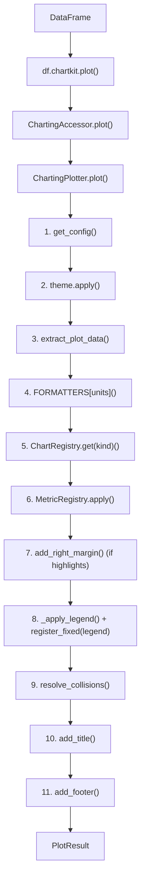

# Architecture

Internal architecture documentation for chartkit contributors.

---

## Component Diagram

```
                    +-------------------+
                    |    DataFrame      |
                    +-------------------+
                            |
                            v
                    +-------------------+
                    | ChartingAccessor  |  (df.chartkit)
                    +-------------------+
                      |       |       |
          +-----------+       |       +-----------+
          v                   v                   v
  +-------------------+ +-----------+ +-------------------+
  | TransformAccessor | |  .layer() | |  ChartingPlotter  |
  +-------------------+ +-----------+ +-------------------+
          |                   |               |
          v                   v               v
  +-------------------+ +-----------+ +-------------------+
  |   Transforms      | |   Layer   | |     PlotResult    |
  +-------------------+ +-----------+ +-------------------+
                              |               ^
                              v               |
                        +-----------+         |
                        | compose() |---------+
                        +-----------+
                              |
                    +---------+---------+
                    v                   v
            +------------+      +------------+
            | ax (left)  |      | ax (right) |
            +------------+      +------------+
```

---

## Data Flow

The main data flow follows the chain:

```
DataFrame -> Accessor -> Plotter -> PlotResult
```

### Detailed Description

1. **DataFrame**: Input data (pandas DataFrame with DatetimeIndex)

2. **ChartingAccessor**: Registered via `@pd.api.extensions.register_dataframe_accessor("chartkit")` and `@pd.api.extensions.register_series_accessor("chartkit")`. Works as the entry point for all operations. Series are converted to DataFrame internally.

3. **TransformAccessor** (optional): When the user calls transforms like `.variation()`, `.accum()`, etc., a TransformAccessor is returned. Each transform returns a new TransformAccessor, enabling chaining.

4. **Two rendering paths**:

   - **Direct** (`plot()`): `ChartingPlotter` orchestrates single-chart creation on one axes
   - **Composed** (`layer()` + `compose()`): `Layer` captures intent without rendering; `compose()` orchestrates multi-layer rendering with optional dual axes via `twinx()`

5. **ChartingPlotter**: Main engine for direct plotting:
   - Applies theme via `theme.apply()`
   - Extracts data via `extract_plot_data()`
   - Applies axis formatters via `FORMATTERS` dispatch table
   - Dispatches via `ChartRegistry.get(kind)` to the registered chart type
   - Applies metrics via `MetricRegistry.apply()`
   - Expands right margin via `add_right_margin()` when highlights are present
   - Applies legend and registers it as fixed obstacle
   - Resolves label collisions via `resolve_collisions(ax)`
   - Adds decorations via `add_title(ax)` and `add_footer(fig)`

6. **compose()**: Orchestrator for multi-layer charts:
   - Creates figure with optional twinx for right axis
   - Renders each layer on its target axes
   - Consolidates legend from both axes
   - Resolves cross-axis collisions via `resolve_composed_collisions(axes)`
   - Returns `PlotResult` with `_ComposePlotter` (satisfies `Saveable` Protocol)

7. **PlotResult**: Encapsulated result with:
   - Reference to Figure and Axes
   - `plotter: Saveable` (Protocol-based, works with both ChartingPlotter and _ComposePlotter)
   - `.save()` and `.show()` methods for chaining
   - `.axes` and `.figure` properties for direct access

### Detailed Visual Flow



---

## Folder Structure

```
src/chartkit/
├── __init__.py           # Entry point, public exports, __getattr__ lazy paths
├── _logging.py           # Logging setup (loguru disable + configure_logging)
├── accessor.py           # Pandas DataFrame/Series accessor (.chartkit)
├── engine.py             # ChartingPlotter - main orchestrator
├── result.py             # PlotResult - chainable result
├── exceptions.py         # ChartKitError (base) and TransformError
│
├── settings/             # Configuration system (pydantic-settings)
│   ├── __init__.py       # Exports: configure, get_config, ChartingConfig
│   ├── schema.py         # Pydantic BaseModel sub-configs + BaseSettings root
│   ├── loader.py         # ConfigLoader singleton + TOML loading + path resolution
│   └── discovery.py      # find_project_root (cached) + find_config_files
│
├── styling/              # Theme and formatters
│   ├── __init__.py       # Facade
│   ├── theme.py          # ChartingTheme (uses settings)
│   ├── formatters.py     # Y-axis formatters (Babel i18n)
│   └── fonts.py          # Custom font loading
│
├── charts/               # Pluggable chart types
│   ├── __init__.py       # Imports trigger automatic registration
│   ├── registry.py       # ChartRegistry + ChartFunc Protocol
│   ├── _helpers.py       # Shared utilities (detect_bar_width, categorical, y_origin)
│   ├── line.py           # Line chart (@ChartRegistry.register("line"))
│   ├── bar.py            # Bar chart (grouped bars, sort, color='cycle')
│   └── stacked_bar.py    # Stacked bars (categorical support)
│
├── composing/            # Multi-layer chart composition
│   ├── __init__.py       # Facade: compose, Layer, AxisSide, create_layer
│   ├── layer.py          # Layer (frozen dataclass) + AxisSide + create_layer()
│   └── compose.py        # compose() orchestrator + _ComposePlotter (Saveable)
│
├── overlays/             # Secondary visual elements
│   ├── __init__.py       # Facade
│   ├── moving_average.py # Moving average
│   ├── reference_lines.py# ATH, ATL, AVG, hlines, target
│   ├── bands.py          # Shaded bands
│   ├── fill_between.py   # Area between two series
│   ├── std_band.py       # Standard deviation band (Bollinger Band)
│   ├── vband.py          # Vertical band between dates
│   └── markers.py        # HighlightStyle + unified add_highlight (last/max/min/all)
│
├── decorations/          # Visual decorations
│   ├── __init__.py       # Facade: add_footer, add_title
│   ├── footer.py         # Footer with branding
│   └── title.py          # Styled title on axes
│
├── metrics/              # Declarative metrics system
│   ├── __init__.py       # Exports, registers builtin metrics
│   ├── registry.py       # MetricRegistry - registration and application
│   └── builtin.py        # Standard metrics (ath, atl, ma, hline, band, target, std_band, vband)
│
├── transforms/           # Temporal transformations
│   ├── __init__.py       # Facade: variation, accum, drawdown, zscore, etc.
│   ├── temporal.py       # Transformation function implementations
│   ├── _validation.py    # Validation, coercion, and frequency resolution
│   └── accessor.py       # TransformAccessor for chaining
│
└── _internal/            # Private utilities (shared between engine and compose)
    ├── __init__.py       # Facade: collision, extraction, formatting, highlight, saving, validation
    ├── collision.py      # Collision engine (single-axis + composed cross-axis)
    ├── extraction.py     # extract_plot_data(), should_show_legend(), resolve_series(), add_right_margin()
    ├── formatting.py     # FORMATTERS dispatch table for Y-axis
    ├── highlight.py      # normalize_highlight()
    ├── plot_validation.py # validate_plot_params(), PlotParamsModel, UnitFormat
    └── saving.py         # save_figure() with path resolution

tests/                    # Test suite
├── conftest.py           # Shared fixtures (financial DataFrames, edge cases, Agg backend)
├── test_formatters.py    # Formatter tests
├── test_accessor_layer.py # Accessor .layer() tests
├── charts/               # Chart rendering tests
├── collision/            # Collision engine tests
├── composing/            # Composition system tests
├── decorations/          # Title and footer tests
├── engine/               # Engine internals tests
├── internal/             # _internal module tests
├── metrics/              # MetricRegistry tests
├── settings/             # Configuration system tests
└── transforms/           # Transform function tests
```

---

## Module Responsibilities

### Core

| Module | Responsibility |
|--------|---------------|
| `_logging.py` | loguru setup (`logger.disable`) + `configure_logging()` |
| `accessor.py` | Registers `.chartkit` on DataFrames and Series; delegates to TransformAccessor, ChartingPlotter, or create_layer |
| `engine.py` | Orchestrates single-chart creation; delegates to `_internal` and `decorations` |
| `result.py` | Encapsulates result (`Saveable` Protocol); enables chaining with `.save()` and `.show()` |

### Settings

| Module | Responsibility |
|--------|---------------|
| `schema.py` | Pydantic BaseModel sub-configs + ChartingConfig (BaseSettings) + _DictSource |
| `loader.py` | ConfigLoader singleton; TOML loading + deep merge; 3-tier path resolution |
| `discovery.py` | find_project_root (LRUCache) + find_config_files + get_user_config_dir |

### Styling

| Module | Responsibility |
|--------|---------------|
| `theme.py` | ChartingTheme; configures matplotlib with colors/fonts from settings |
| `formatters.py` | Y-axis formatters (BRL, USD, %, human, points) using Babel |
| `fonts.py` | Loads custom fonts from assets_path |

### Charts and Overlays

| Module | Responsibility |
|--------|---------------|
| `charts/registry.py` | ChartRegistry: decorator + dict + get/available |
| `charts/_helpers.py` | Shared utilities (detect_bar_width, categorical index, y_origin, validate_y_origin) |
| `charts/line.py` | Renders line chart + registers line obstacles for collision |
| `charts/bar.py` | Renders bar chart (grouped bars, sort, color='cycle', categorical) |
| `charts/stacked_bar.py` | Renders stacked bars (categorical support) |
| `composing/layer.py` | Layer (frozen dataclass) + AxisSide + create_layer() with eager validation |
| `composing/compose.py` | compose() orchestrator; dual-axis, cross-axis collisions, _ComposePlotter |
| `overlays/*` | Adds secondary elements (MA, ATH/ATL/AVG, bands, markers, fill_between, std_band, vband) |
| `decorations/footer.py` | Adds footer with branding and source |
| `decorations/title.py` | Adds styled title on axes |

### Metrics

| Module | Responsibility |
|--------|---------------|
| `registry.py` | MetricRegistry for registering and applying metrics |
| `builtin.py` | Registers standard metrics as overlay wrappers (ath, atl, avg, ma, hline, band, target, std_band, vband) |

### Transforms

| Module | Responsibility |
|--------|---------------|
| `temporal.py` | Pure transformation functions (variation, accum, drawdown, zscore, etc.) |
| `accessor.py` | TransformAccessor for transform chaining |

---

## Configuration Precedence Order

Configuration is loaded from multiple sources with merge:

1. `configure()` init_settings - Programmatic overrides (highest priority)
2. Env vars (`CHARTKIT_*`, nested `__`)
3. TOML files (`.charting.toml` > `pyproject.toml [tool.charting]` > user config)
4. Field defaults from pydantic models (lowest priority)

---

## Code Conventions

### Accessing Configuration

Always use `get_config()` inside functions, never cache globally:

```python
# CORRECT
def my_function():
    config = get_config()
    color = config.colors.primary

# INCORRECT (doesn't reflect changes via configure())
config = get_config()  # Global
def my_function():
    color = config.colors.primary
```

### zorder (Rendering Layers)

| Layer | zorder | Elements |
|-------|--------|----------|
| Background | 0 | Shaded bands |
| Reference | 1 | ATH, ATL, hlines |
| Secondary | 2 | Moving average |
| Data | 3+ | Lines, bars |

### Function Returns

- `plot_*()`: No return (modifies ax in-place)
- `add_*()`: No return (modifies ax/fig in-place)
- `ChartingPlotter.plot()`: Returns `PlotResult`
- Transforms: Return `TransformAccessor` (chainable)

---

## Internal Dependency Graph (Settings)

```
__init__.py
    <- loader.py
        <- discovery.py
        <- schema.py
    <- schema.py
```

**Important:** Avoid circular imports. `loader.py` is the central hub.
New modules should import from `schema.py`, never from `loader.py`.
