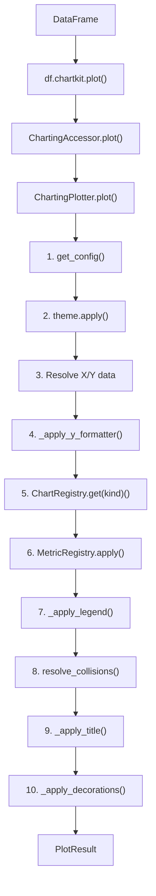

# Arquitetura

Documentacao da arquitetura interna do chartkit para contribuidores.

---

## Diagrama de Componentes

```
                    +-------------------+
                    |    DataFrame      |
                    +-------------------+
                            |
                            v
                    +-------------------+
                    | ChartingAccessor  |  (df.chartkit)
                    +-------------------+
                        |         |
            +-----------+         +-----------+
            v                                 v
    +-------------------+           +-------------------+
    | TransformAccessor |           |  ChartingPlotter  |
    +-------------------+           +-------------------+
            |                               |
            v                               v
    +-------------------+           +-------------------+
    |   Transforms      |           |     PlotResult    |
    +-------------------+           +-------------------+
                                            |
                    +-----------------------+
                    v
        +-------------------+
        |    matplotlib     |
        |  (Figure/Axes)    |
        +-------------------+
```

---

## Fluxo de Dados

O fluxo principal de dados segue a cadeia:

```
DataFrame -> Accessor -> Plotter -> PlotResult
```

### Descricao Detalhada

1. **DataFrame**: Dados de entrada (pandas DataFrame com DatetimeIndex)

2. **ChartingAccessor**: Registrado via `@pd.api.extensions.register_dataframe_accessor("chartkit")` e `@pd.api.extensions.register_series_accessor("chartkit")`. Funciona como ponto de entrada para todas as operacoes. Series sao convertidas para DataFrame internamente.

3. **TransformAccessor** (opcional): Quando o usuario chama transforms como `.variation()`, `.accum()`, etc., um TransformAccessor e retornado. Cada transform retorna um novo TransformAccessor, permitindo encadeamento.

4. **ChartingPlotter**: Motor principal que orquestra a criacao do grafico:
   - Aplica tema via `theme.apply()`
   - Resolve dados X/Y
   - Aplica formatadores de eixo
   - Despacha via `ChartRegistry.get(kind)` para o chart type registrado
   - Aplica metricas via `MetricRegistry.apply()`
   - Aplica legenda via `_apply_legend()` (auto-detecta com 2+ artists)
   - Resolve colisoes de labels
   - Adiciona decoracoes (footer)

5. **PlotResult**: Resultado encapsulado com:
   - Referencia ao Figure e Axes
   - Metodos `.save()` e `.show()` para encadeamento
   - Properties `.axes` e `.figure` para acesso direto

### Fluxo Visual Detalhado



---

## Estrutura de Pastas

```
src/chartkit/
├── __init__.py           # Entry point, exports publicos, __getattr__ lazy paths
├── _logging.py           # Logging setup (loguru disable + configure_logging)
├── accessor.py           # Pandas DataFrame/Series accessor (.chartkit)
├── engine.py             # ChartingPlotter - orquestrador principal
├── result.py             # PlotResult - resultado encadeavel
├── exceptions.py         # ChartKitError (base) e TransformError
│
├── settings/             # Sistema de configuracao (pydantic-settings)
│   ├── __init__.py       # Exports: configure, get_config, ChartingConfig
│   ├── schema.py         # Pydantic BaseModel sub-configs + BaseSettings root
│   ├── loader.py         # ConfigLoader singleton + TOML loading + path resolution
│   └── discovery.py      # find_project_root (cached) + find_config_files
│
├── styling/              # Tema e formatadores
│   ├── __init__.py       # Facade
│   ├── theme.py          # ChartingTheme (usa settings)
│   ├── formatters.py     # Formatadores de eixo Y (Babel i18n)
│   └── fonts.py          # Carregamento de fontes customizadas
│
├── charts/               # Tipos de graficos plugaveis
│   ├── __init__.py       # Imports disparam registro automatico
│   ├── registry.py       # ChartRegistry + ChartFunc Protocol
│   ├── _helpers.py       # Utilitarios compartilhados (detect_bar_width)
│   ├── line.py           # Grafico de linhas (@ChartRegistry.register("line"))
│   ├── bar.py            # Grafico de barras (@ChartRegistry.register("bar"))
│   └── stacked_bar.py    # Barras empilhadas (@ChartRegistry.register("stacked_bar"))
│
├── overlays/             # Elementos visuais secundarios
│   ├── __init__.py       # Facade
│   ├── moving_average.py # Media movel
│   ├── reference_lines.py# ATH, ATL, AVG, hlines, target
│   ├── bands.py          # Bandas sombreadas
│   ├── fill_between.py   # Area entre duas series
│   ├── std_band.py       # Banda de desvio padrao (Bollinger Band)
│   ├── vband.py          # Banda vertical entre datas
│   └── markers.py        # HighlightStyle + add_highlight unificado
│
├── decorations/          # Decoracoes visuais
│   ├── __init__.py       # Facade: add_footer
│   └── footer.py         # Rodape com branding
│
├── metrics/              # Sistema de metricas declarativas
│   ├── __init__.py       # Exports, registra metricas builtin
│   ├── registry.py       # MetricRegistry - registro e aplicacao
│   └── builtin.py        # Metricas padrao (ath, atl, ma, hline, band, target, std_band, vband)
│
├── transforms/           # Transformacoes temporais
│   ├── __init__.py       # Facade: variation, accum, drawdown, zscore, etc.
│   ├── temporal.py       # Implementacoes das funcoes de transformacao
│   ├── _validation.py    # Validacao, coercao e resolucao de frequencia
│   └── accessor.py       # TransformAccessor para encadeamento
│
└── _internal/            # Utilitarios privados
    ├── __init__.py       # Facade: register_moveable, register_fixed, register_passive, resolve_collisions
    └── collision.py      # Engine generica de resolucao de colisao (bbox-based)
```

---

## Responsabilidades de Cada Modulo

### Core

| Modulo | Responsabilidade |
|--------|-----------------|
| `_logging.py` | Setup de loguru (`logger.disable`) + `configure_logging()` |
| `accessor.py` | Registra `.chartkit` em DataFrames e Series; delega para TransformAccessor ou ChartingPlotter |
| `engine.py` | Orquestra criacao de graficos; gerencia Figure/Axes; aplica componentes |
| `result.py` | Encapsula resultado; permite encadeamento com `.save()` e `.show()` |

### Settings

| Modulo | Responsabilidade |
|--------|-----------------|
| `schema.py` | Pydantic BaseModel sub-configs + ChartingConfig (BaseSettings) + _DictSource |
| `loader.py` | ConfigLoader singleton; TOML loading + deep merge; path resolution 3-tier |
| `discovery.py` | find_project_root (LRUCache) + find_config_files + get_user_config_dir |

### Styling

| Modulo | Responsabilidade |
|--------|-----------------|
| `theme.py` | ChartingTheme; configura matplotlib com cores/fontes do settings |
| `formatters.py` | Formatadores de eixo Y (BRL, USD, %, human, points) usando Babel |
| `fonts.py` | Carrega fontes customizadas do assets_path |

### Charts e Overlays

| Modulo | Responsabilidade |
|--------|-----------------|
| `charts/registry.py` | ChartRegistry: decorator + dict + get/available |
| `charts/_helpers.py` | Utilitarios compartilhados (detect_bar_width) |
| `charts/line.py` | Renderiza grafico de linhas (registrado via @ChartRegistry.register) |
| `charts/bar.py` | Renderiza grafico de barras (registrado via @ChartRegistry.register) |
| `charts/stacked_bar.py` | Renderiza barras empilhadas (registrado via @ChartRegistry.register) |
| `overlays/*` | Adiciona elementos secundarios (MA, ATH/ATL/AVG, bandas, markers, fill_between, std_band, vband) |
| `decorations/footer.py` | Adiciona rodape com branding e fonte |

### Metrics

| Modulo | Responsabilidade |
|--------|-----------------|
| `registry.py` | MetricRegistry para registrar e aplicar metricas |
| `builtin.py` | Registra metricas padrao como wrappers dos overlays (ath, atl, avg, ma, hline, band, target, std_band, vband) |

### Transforms

| Modulo | Responsabilidade |
|--------|-----------------|
| `temporal.py` | Funcoes puras de transformacao (variation, accum, drawdown, zscore, etc.) |
| `accessor.py` | TransformAccessor para encadeamento de transforms |

---

## Ordem de Precedencia de Configuracao

A configuracao e carregada de multiplas fontes com merge:

1. `configure()` init_settings - Overrides programaticos (maior prioridade)
2. Env vars (`CHARTKIT_*`, nested `__`)
3. TOML files (`.charting.toml` > `pyproject.toml [tool.charting]` > user config)
4. Field defaults dos pydantic models (menor prioridade)

---

## Convencoes de Codigo

### Acesso a Configuracoes

Sempre usar `get_config()` dentro de funcoes, nunca cachear globalmente:

```python
# CORRETO
def minha_funcao():
    config = get_config()
    cor = config.colors.primary

# INCORRETO (nao reflete mudancas via configure())
config = get_config()  # Global
def minha_funcao():
    cor = config.colors.primary
```

### zorder (Camadas de Renderizacao)

| Camada | zorder | Elementos |
|--------|--------|-----------|
| Fundo | 0 | Bandas sombreadas |
| Referencia | 1 | ATH, ATL, hlines |
| Secundario | 2 | Media movel |
| Dados | 3+ | Linhas, barras |

### Retornos de Funcao

- `plot_*()`: Nao retorna (modifica ax in-place)
- `add_*()`: Nao retorna (modifica ax/fig in-place)
- `ChartingPlotter.plot()`: Retorna `PlotResult`
- Transforms: Retornam `TransformAccessor` (encadeavel)

---

## Grafo de Dependencias Internas (Settings)

```
__init__.py
    <- loader.py
        <- discovery.py
        <- schema.py
    <- schema.py
```

**Importante:** Evitar imports circulares. `loader.py` e o hub central.
Novos modulos devem importar de `schema.py`, nunca de `loader.py`.
