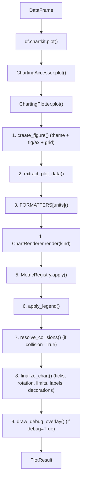

# Architecture

Internal architecture documentation for chartkit contributors.

---

## Component Diagram

```
                    +-------------------+
                    |    DataFrame      |
                    +-------------------+
                            |
                            v
                    +-------------------+
                    | ChartingAccessor  |  (df.chartkit)
                    +-------------------+
                      |       |       |
          +-----------+       |       +-----------+
          v                   v                   v
  +-------------------+ +-----------+ +-------------------+
  | TransformAccessor | |  .layer() | |  ChartingPlotter  |
  +-------------------+ +-----------+ +-------------------+
          |                   |               |
          v                   v               v
  +-------------------+ +-----------+ +-------------------+
  |   Transforms      | |   Layer   | |     PlotResult    |
  +-------------------+ +-----------+ +-------------------+
                              |               ^
                              v               |
                        +-----------+         |
                        | compose() |---------+
                        +-----------+
                              |
                    +---------+---------+
                    v                   v
            +------------+      +------------+
            | ax (left)  |      | ax (right) |
            +------------+      +------------+
```

---

## Data Flow

The main data flow follows the chain:

```
DataFrame -> Accessor -> Plotter -> PlotResult
```

### Detailed Description

1. **DataFrame**: Input data (pandas DataFrame with DatetimeIndex)

2. **ChartingAccessor**: Registered via `@pd.api.extensions.register_dataframe_accessor("chartkit")` and `@pd.api.extensions.register_series_accessor("chartkit")`. Works as the entry point for all operations. Series are converted to DataFrame internally.

3. **TransformAccessor** (optional): When the user calls transforms like `.variation()`, `.accum()`, etc., a TransformAccessor is returned. Each transform returns a new TransformAccessor, enabling chaining.

4. **Two rendering paths**:

   - **Direct** (`plot()`): `ChartingPlotter` orchestrates single-chart creation on one axes
   - **Composed** (`layer()` + `compose()`): `Layer` captures intent without rendering; `compose()` orchestrates multi-layer rendering with optional dual axes via `twinx()`

5. **ChartingPlotter**: Main engine for direct plotting:
   - Creates figure via `create_figure()` (theme + plt.subplots + grid override)
   - Extracts data via `extract_plot_data()`
   - Applies axis formatters via `FORMATTERS` dispatch table
   - Dispatches via `ChartRenderer.render(ax, kind, ...)` (enhancer or generic `ax.{kind}()`)
   - Applies metrics via `MetricRegistry.apply()`
   - Applies legend via `apply_legend()`
   - Resolves label collisions via `resolve_collisions(ax)` (when `collision=True`)
   - Finalizes via `finalize_chart()` (tick formatting, tick rotation, axis limits, labels, decorations)
   - Draws debug overlay via `draw_debug_overlay(ax)` (when `debug=True`, after finalize)

6. **compose()**: Orchestrator for multi-layer charts:
   - Creates figure via `create_figure()` with optional twinx for right axis
   - Renders each layer on its target axes
   - Applies legend via `apply_legend()` (consolidates handles from both axes)
   - Resolves cross-axis collisions via `resolve_composed_collisions(axes)`
   - Finalizes via `finalize_chart()` (shared pipeline)
   - Draws debug overlay via `draw_composed_debug_overlay(axes)` (when `debug=True`, after finalize)
   - Returns `PlotResult` with `_ComposePlotter` (satisfies `Saveable` Protocol)

7. **PlotResult**: Encapsulated result with:
   - Reference to Figure and Axes
   - `plotter: Saveable` (Protocol-based, works with both ChartingPlotter and _ComposePlotter)
   - `.save()` and `.show()` methods for chaining
   - `.axes` and `.figure` properties for direct access

### Detailed Visual Flow


```mermaid
flowchart TD
    A[DataFrame] --> B["df.chartkit.plot()"]
    B --> C["ChartingAccessor.plot()"]
    C --> D["ChartingPlotter.plot()"]

    D --> D1["1. create_figure() (theme + fig/ax + grid)"]
    D1 --> D3["2. extract_plot_data()"]
    D3 --> D4["3. FORMATTERS[units]()"]
    D4 --> D5["4. ChartRenderer.render(kind)"]
    D5 --> D6["5. MetricRegistry.apply()"]
    D6 --> D6b["6. apply_legend()"]
    D6b --> D7["7. resolve_collisions() (if collision=True)"]
    D7 --> D8["8. finalize_chart() (ticks, rotation, limits, labels, decorations)"]
    D8 --> D9["9. draw_debug_overlay() (if debug=True)"]
    D9 --> E["PlotResult"]
```

---

## Folder Structure

```
src/chartkit/
├── __init__.py           # Entry point, public exports, __getattr__ lazy paths
├── _logging.py           # Logging setup (loguru disable + configure_logging)
├── accessor.py           # Pandas DataFrame/Series accessor (.chartkit)
├── engine.py             # ChartingPlotter - main orchestrator
├── result.py             # PlotResult - chainable result
├── exceptions.py         # ChartKitError (base) and TransformError
│
├── settings/             # Configuration system (pydantic-settings)
│   ├── __init__.py       # Exports: configure, get_config, ChartingConfig
│   ├── schema.py         # Pydantic BaseModel sub-configs + BaseSettings root
│   ├── loader.py         # ConfigLoader singleton + TOML loading + path resolution
│   └── discovery.py      # find_project_root (cached) + find_config_files
│
├── styling/              # Theme and formatters
│   ├── __init__.py       # Facade
│   ├── theme.py          # ChartingTheme (uses settings)
│   ├── formatters.py     # Y-axis formatters (Babel i18n)
│   └── fonts.py          # Custom font loading
│
├── charts/               # Generic rendering + enhancers
│   ├── __init__.py       # Enhancer imports trigger automatic registration
│   ├── renderer.py       # ChartRenderer - generic rendering (ax.{kind}()) + enhancer dispatch
│   ├── _helpers.py       # RenderContext, prepare_render_context(), resolve_color() + bar/category utilities
│   └── enhancers/        # Specialized handlers for complex chart types
│       ├── __init__.py   # Auto-imports all enhancers (triggers registration)
│       ├── area.py       # Area chart enhancer (fill_between semantics)
│       ├── bar.py        # Bar + barh enhancer (grouped bars, sort, color='cycle')
│       ├── ecdf.py       # Empirical CDF enhancer
│       ├── eventplot.py  # Event position enhancer
│       ├── hist.py       # Histogram enhancer
│       ├── pie.py        # Pie chart enhancer
│       ├── stackplot.py  # Stacked area enhancer
│       ├── stacked_bar.py # Stacked bar enhancer (categorical support)
│       ├── stairs.py     # Step function enhancer
│       ├── statistical.py # Boxplot + violinplot enhancer
│       └── stem.py       # Stem plot enhancer
│
├── composing/            # Multi-layer chart composition
│   ├── __init__.py       # Facade: compose, Layer, AxisSide, create_layer
│   ├── layer.py          # Layer (frozen dataclass) + AxisSide + create_layer()
│   └── compose.py        # compose() orchestrator + _ComposePlotter (Saveable)
│
├── overlays/             # Secondary visual elements
│   ├── __init__.py       # Facade
│   ├── moving_average.py # Moving average
│   ├── reference_lines.py# ATH, ATL, AVG, hlines, target
│   ├── bands.py          # Shaded bands
│   ├── std_band.py       # Standard deviation band (Bollinger Band)
│   ├── vband.py          # Vertical band between dates
│   └── markers.py        # HighlightStyle + unified add_highlight (last/max/min/all)
│
├── decorations/          # Visual decorations
│   ├── __init__.py       # Facade: add_footer, add_title
│   ├── footer.py         # Footer with branding
│   └── title.py          # Styled title on axes
│
├── metrics/              # Declarative metrics system
│   ├── __init__.py       # Exports, registers builtin metrics
│   ├── registry.py       # MetricRegistry - registration and application
│   └── builtin.py        # Standard metrics (ath, atl, ma, hline, band, target, std_band, vband)
│
├── transforms/           # Temporal transformations
│   ├── __init__.py       # Facade: variation, accum, drawdown, zscore, etc.
│   ├── temporal.py       # Transformation function implementations
│   ├── _validation.py    # Validation, coercion, and frequency resolution
│   └── accessor.py       # TransformAccessor for chaining
│
└── _internal/            # Private utilities (shared between engine and compose)
    ├── __init__.py       # Facade: collision, extraction, formatting, frequency, highlight, pipeline, saving, validation
    ├── collision/        # Collision engine (modularized package)
    │   ├── __init__.py   # Re-exports public API (register_*, resolve_*, draw_*_debug_overlay)
    │   ├── _registry.py  # Global state and artist registration (WeakKeyDictionary)
    │   ├── _obstacles.py # _PathObstacle, _classify_artist(), and obstacle collection
    │   ├── _engine.py    # Collision resolution algorithm + standalone debug overlay entry points
    │   └── _debug.py     # Debug overlay rendering
    ├── extraction.py     # extract_plot_data(), should_show_legend(), resolve_series()
    ├── formatting.py     # FORMATTERS dispatch table for Y-axis
    ├── frequency.py      # Frequency detection and display (FREQ_ALIASES, infer_freq, normalize_freq_code, freq_display_label, FREQ_DISPLAY_MAP)
    ├── highlight.py      # normalize_highlight()
    ├── pipeline.py       # Shared pipeline steps: create_figure(), apply_legend(), finalize_chart()
    ├── plot_validation.py # validate_plot_params(), PlotParamsModel, UnitFormat, TickFreq, AxisLimits
    ├── saving.py         # save_figure() with path resolution
    ├── tick_formatting.py # apply_tick_formatting(x_data) - data-aware date locator/formatter for X-axis
    └── tick_rotation.py  # apply_tick_rotation() - auto/fixed X-axis label rotation

tests/                    # Test suite (448 tests)
├── conftest.py           # Shared fixtures (financial DataFrames, edge cases, Agg backend)
├── charts/               # Chart rendering tests (67)
├── collision/            # Collision engine tests (19)
├── composing/            # Composition system tests (29)
├── formatting/           # Formatters and highlight tests (41)
├── integration/          # End-to-end tests (18)
├── metrics/              # MetricRegistry tests (28)
├── settings/             # Configuration system tests (23)
└── transforms/           # Transform function tests (142)
```

---

## Module Responsibilities

### Core

| Module | Responsibility |
|--------|---------------|
| `_logging.py` | loguru setup (`logger.disable`) + `configure_logging()` |
| `accessor.py` | Registers `.chartkit` on DataFrames and Series; delegates to TransformAccessor, ChartingPlotter, or create_layer |
| `engine.py` | Orchestrates single-chart creation; delegates to `_internal` (pipeline, rendering, collision) |
| `result.py` | Encapsulates result (`Saveable` Protocol); enables chaining with `.save()` and `.show()` |

### Settings

| Module | Responsibility |
|--------|---------------|
| `schema.py` | Pydantic BaseModel sub-configs + ChartingConfig (BaseSettings) + _DictSource |
| `loader.py` | ConfigLoader singleton; TOML loading + deep merge; 3-tier path resolution |
| `discovery.py` | find_project_root (LRUCache) + find_config_files + get_user_config_dir |

### Styling

| Module | Responsibility |
|--------|---------------|
| `theme.py` | ChartingTheme; configures matplotlib with colors/fonts from settings |
| `formatters.py` | Y-axis formatters (BRL, USD, %, human, points) using Babel |
| `fonts.py` | Loads custom fonts from assets_path |

### Charts and Overlays

| Module | Responsibility |
|--------|---------------|
| `charts/renderer.py` | ChartRenderer: generic rendering via `ax.{kind}()` + enhancer dispatch + line obstacle registration |
| `charts/_helpers.py` | RenderContext dataclass + prepare_render_context/resolve_color for enhancers + bar/category utilities (detect_bar_width, apply_y_origin, etc.) |
| `charts/enhancers/*.py` | 13 enhancers: bar, barh, stacked_bar, area, hist, pie, stackplot, stem, stairs, boxplot, violinplot, ecdf, eventplot |
| `composing/layer.py` | Layer (frozen dataclass) + AxisSide + create_layer() with eager validation |
| `_internal/pipeline.py` | Shared pipeline steps: create_figure(), apply_legend(), finalize_chart() |
| `composing/compose.py` | compose() orchestrator; dual-axis, cross-axis collisions, _ComposePlotter |
| `overlays/*` | Adds secondary elements (MA, ATH/ATL/AVG, bands, markers, std_band, vband) |
| `decorations/footer.py` | Adds footer with branding and source |
| `decorations/title.py` | Adds styled title on axes |

### Metrics

| Module | Responsibility |
|--------|---------------|
| `registry.py` | MetricRegistry for registering and applying metrics; supports `uses_freq` for frequency-aware metrics |
| `builtin.py` | Registers standard metrics as overlay wrappers (ath, atl, avg, ma, hline, band, target, std_band, vband); `ma` and `std_band` are frequency-aware |

### Transforms

| Module | Responsibility |
|--------|---------------|
| `temporal.py` | Pure transformation functions (variation, accum, drawdown, zscore, etc.) |
| `_validation.py` | Validation, coercion, and frequency-to-periods resolution (imports `infer_freq`/`normalize_freq_code` from `_internal/frequency.py`) |
| `accessor.py` | TransformAccessor for transform chaining |

### Internal Utilities

| Module | Responsibility |
|--------|---------------|
| `_internal/frequency.py` | Shared frequency detection and display: `FREQ_ALIASES`, `normalize_freq_code()`, `infer_freq()` (accepts DataFrame, Series, or Index), `FREQ_DISPLAY_MAP`, `freq_display_label()` |

---

## Configuration Precedence Order

Configuration is loaded from multiple sources with merge:

1. `configure()` init_settings - Programmatic overrides (highest priority)
2. Env vars (`CHARTKIT_*`, nested `__`)
3. TOML files (`.charting.toml` > `pyproject.toml [tool.charting]` > user config)
4. Field defaults from pydantic models (lowest priority)

---

## Code Conventions

### Accessing Configuration

Always use `get_config()` inside functions, never cache globally:

```python
# CORRECT
def my_function():
    config = get_config()
    color = config.colors.primary

# INCORRECT (doesn't reflect changes via configure())
config = get_config()  # Global
def my_function():
    color = config.colors.primary
```

### zorder (Rendering Layers)

| Layer | zorder | Elements |
|-------|--------|----------|
| Background | 0 | Shaded bands |
| Reference | 1 | ATH, ATL, hlines |
| Secondary | 2 | Moving average |
| Data | 3+ | Lines, bars |

### Function Returns

- `plot_*()`: No return (modifies ax in-place)
- `add_*()`: No return (modifies ax/fig in-place)
- `ChartingPlotter.plot()`: Returns `PlotResult`
- Transforms: Return `TransformAccessor` (chainable)

---

## Internal Dependency Graph (Settings)

```
__init__.py
    <- loader.py
        <- discovery.py
        <- schema.py
    <- schema.py
```

**Important:** Avoid circular imports. `loader.py` is the central hub.
New modules should import from `schema.py`, never from `loader.py`.
