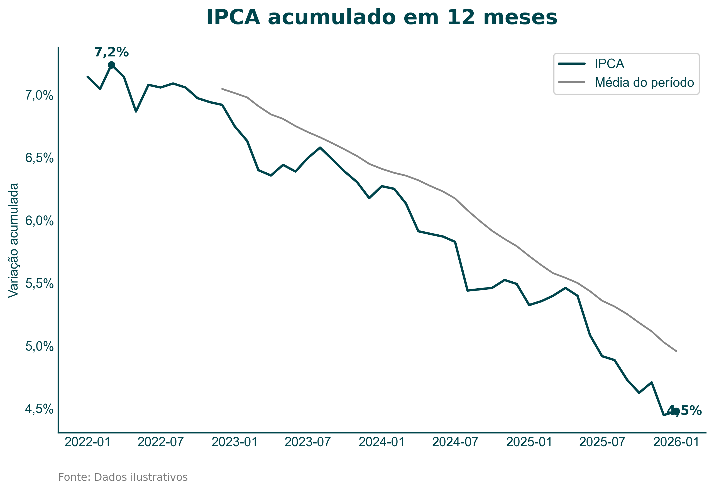
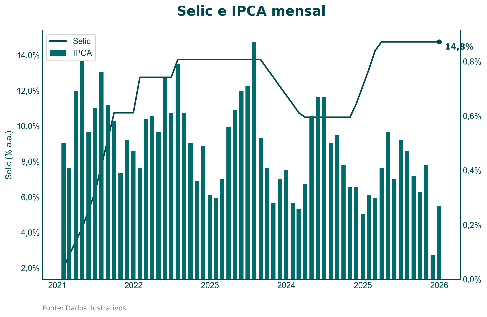
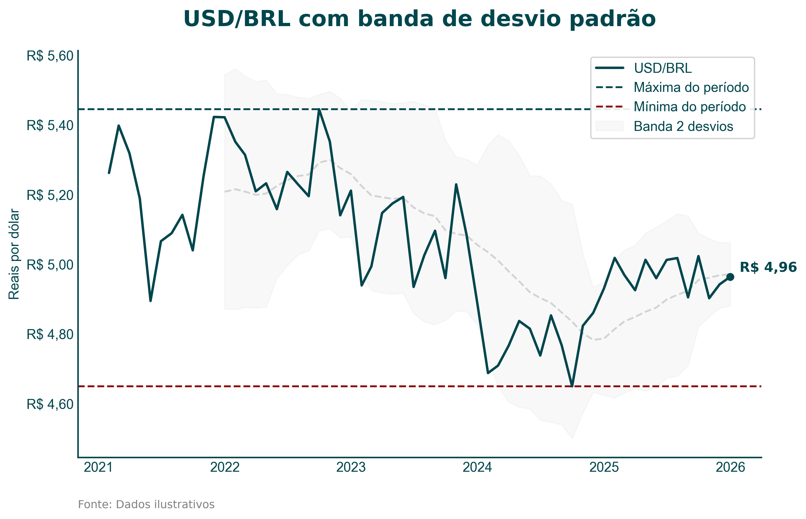
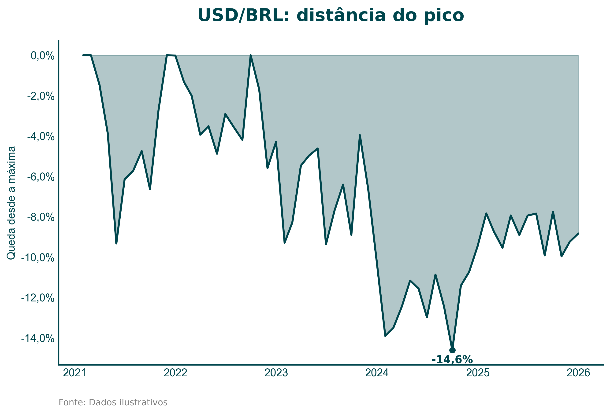
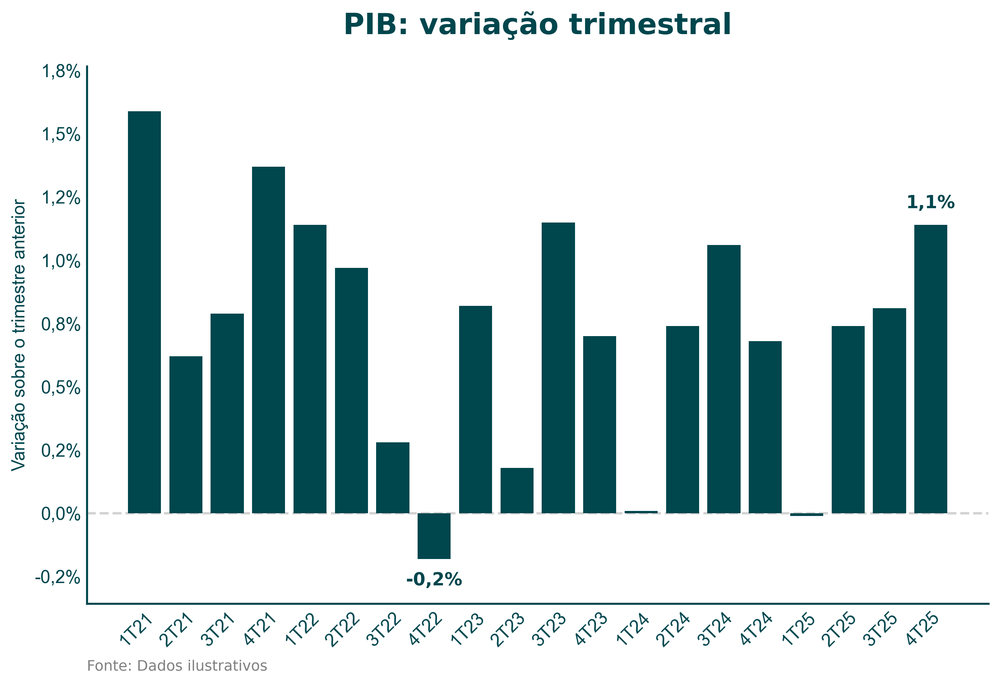

# Gallery

Charts produced by the scripts in [`examples/`](../examples), rendered with
the default theme and no per-chart styling. Every one is reproducible with
`uv run python examples/render_all.py`.

The underlying series are synthetic and generated from a fixed seed. Their
magnitudes track the real indicators, but they are illustrative and must not
be cited as data.

---

## IPCA accumulated over 12 months

Monthly inflation prints compounded into the headline rate, with a moving
average, the latest print, and the period high marked.



```python
ipca.chartkit.accum().plot(
    title="IPCA acumulado em 12 meses",
    units="%",
    source="Dados ilustrativos",
    ylabel="Variação acumulada",
    highlight=["last", "max"],
    metrics=["ma:12|Média do período"],
)
```

`accum()` compounds rather than sums, and reads its window from the detected
frequency. The average starts on its twelfth point, because a line labelled
`ma:12` should not be drawn from fewer samples than that.

---

## Policy rate against monthly inflation

Two series on two scales in one chart: Selic in percent per year, IPCA in
percent per month.



```python
from chartkit import compose

selic = selic_df.chartkit.layer(units="%", highlight=["last"])
ipca = ipca_df.chartkit.layer(kind="bar", units="%", axis="right")

compose(
    selic,
    ipca,
    title="Selic e IPCA mensal",
    source="Dados ilustrativos",
    ylabel="Selic (% a.a.)",
)
```

One palette advances across both layers, so the consolidated legend never
shows a colour standing for two series.

---

## USD/BRL with a standard deviation band

Currency formatting, reference metrics, and a rolling band.



```python
usd.chartkit.plot(
    title="USD/BRL com banda de desvio padrão",
    units="BRL",
    source="Dados ilustrativos",
    ylabel="Reais por dólar",
    highlight=["last"],
    metrics=["ath|Máxima do período", "atl|Mínima do período", "std_band:12:2|Banda 2 desvios"],
)
```

`units="BRL"` routes through Babel, so the axis reads `R$ 5,60` with the
decimal comma rather than a dollar sign and a period.

---

## The same series read as a drawdown

How far the real sits below its strongest reading, which is the question a
hedging deck actually asks.



```python
usd.chartkit.drawdown().plot(
    title="USD/BRL: distância do pico",
    units="%",
    source="Dados ilustrativos",
    ylabel="Queda desde a máxima",
    kind="area",
    highlight=["min"],
)
```

---

## Quarterly GDP

Bars where the sign carries the reading, with a zero line separating growth
from contraction.



```python
df.index = [f"{d.quarter}T{d.year % 100:02d}" for d in df.index]

df.chartkit.plot(
    kind="bar",
    title="PIB: variação trimestral",
    units="%",
    source="Dados ilustrativos",
    ylabel="Variação sobre o trimestre anterior",
    highlight=["last", "min"],
    metrics=["hline:0"],
    y_origin="auto",
)
```

The index becomes `1T24`-style labels first, which is how quarterly GDP is
read in a Brazilian deck. Twenty of them leave about a pixel between
neighbours, so auto-rotation tips them to 45 degrees on its own.
